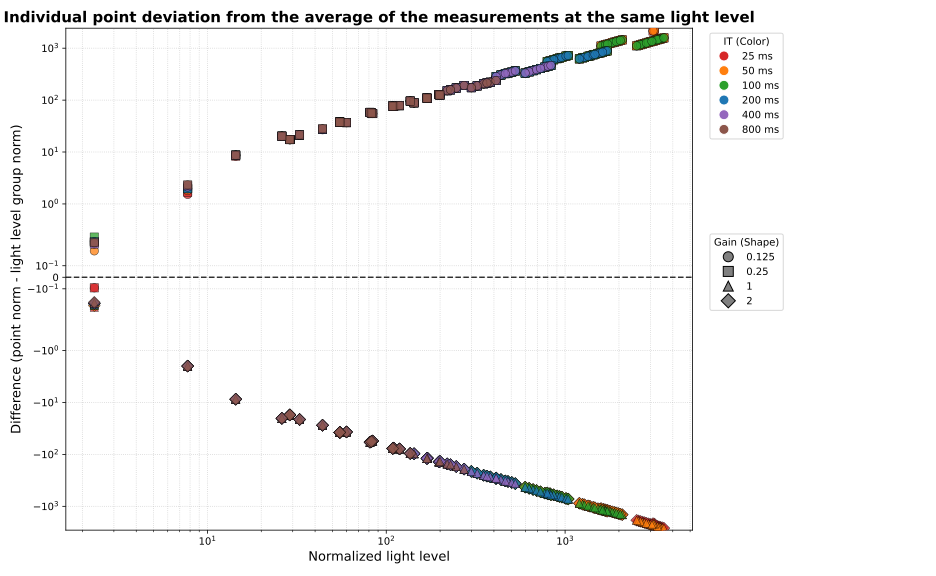
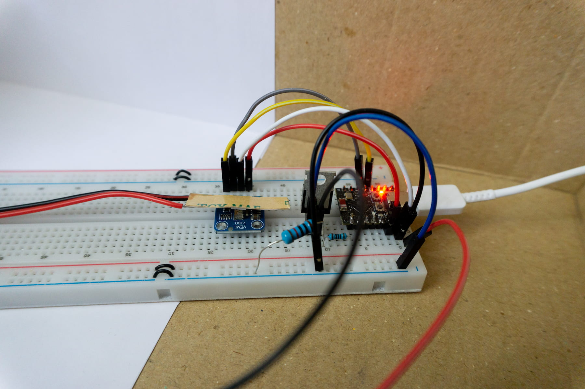
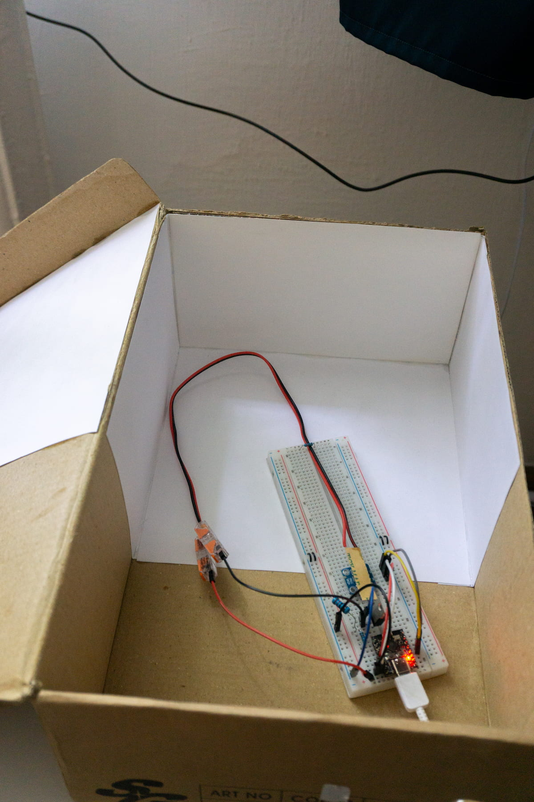
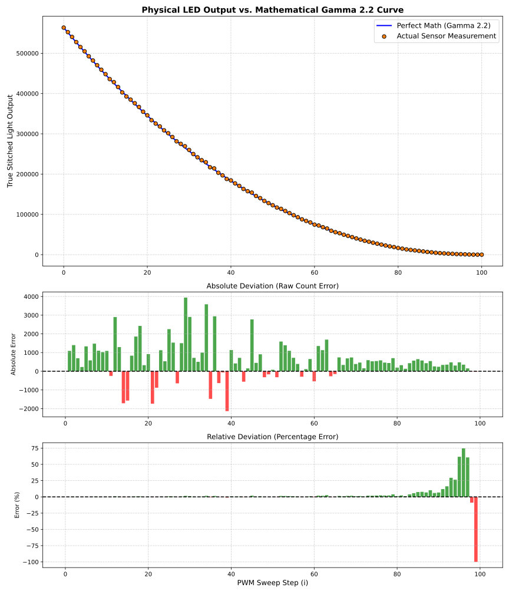
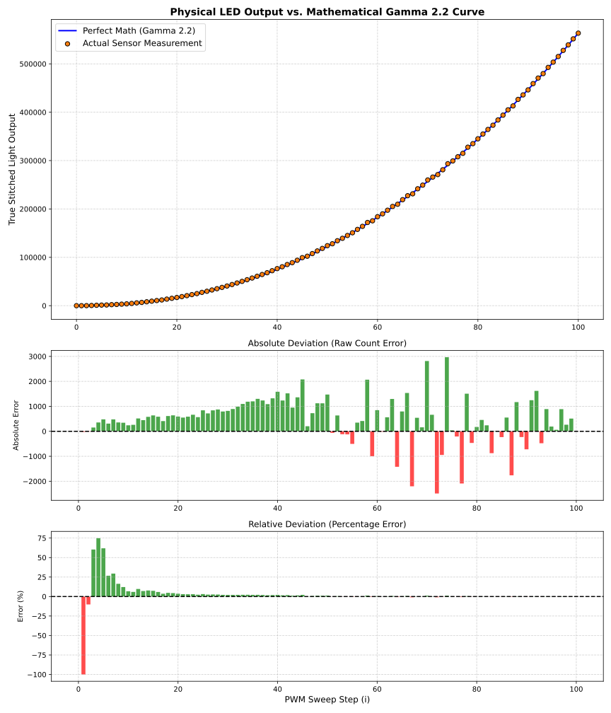

# Calibration for VEML7700

VEML7700 is a digital ambient light sensor. It is accurate and covers large light level range. However, it has one slight issue:
Taking measurements with different settings but at the same light yields different **normalized** readings. And it's not just a constant error, but dependent on the light level.

This graph visualize this. The x-axis is light level. All settings have been used at every light level. The center line (0) is the average of all **normalized** measurements taken at the same light level but with different settings.

The `scr_mcu` directory contains the script for calibration. The calibration needs a pwm controllable led placed on top of the sensor so the program can set any brightness that is necessary for the calibration.

The result of the calibration:

Example code for the sensor that uses this calibration can be found at the examples directory.